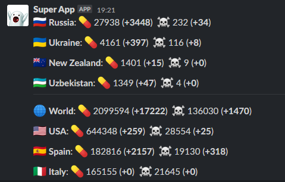

Coronavirus (COVID-19) statistics with Slack notification

COVID-19 datasource: https://corona.lmao.ninja 

## Features

- Send statistics on daily basis (at 4:00AM UTC+0)
- Send statistics in chat by slack command `/corona-stats`




## Installation

### Docker container
Project provides complete [docker image](https://hub.docker.com/repository/docker/mdsina/corona-slack/) for usage.
To run docker container you should do the following steps:
- `mkdir -p /opt/corona-stats && touch /opt/corona-slack/env.list`
- Put environment variables `SLACK_CHANNEL` and `SLACK_TOKEN` to `/opt/corona-slack/env.list` 
`SLACK_CHANNEL` - Slack channel id \
`SLACK_TOKEN` - Slack bot token
- Run `docker run --rm --name docker.corona-slack.service --env-file /opt/corona-slack/env.list -p 8082:8080 mdsina/corona-slack:latest`
- Slack requires `https` protocol connection, so you need a front proxy before application that can be accessible though `https`. You can do that though `nginx` as for example:
```
location ~ ^/corona-bot(/?)(.*) {
    proxy_pass          http://0.0.0.0:8082/$2;
    proxy_set_header    Host             $host;
    proxy_set_header    X-Real-IP        $remote_addr;
    proxy_set_header    X-Forwarded-For  $proxy_add_x_forwarded_for;
    proxy_set_header    X-Client-Verify  SUCCESS;
    proxy_set_header    X-Client-DN      $ssl_client_s_dn;
    proxy_set_header    X-SSL-Subject    $ssl_client_s_dn;
    proxy_set_header    X-SSL-Issuer     $ssl_client_i_dn;
    proxy_read_timeout 1800;
    proxy_connect_timeout 1800;
}
```
- After that specify URL to `https://<server>/corona-bot/corona/stats` in your Slack App configuration for slash command

You can also use [docker.corona-slack.service](./systemd/docker.corona-slack.service) file that can pull docker image and run container without any additional configuration, except `/opt/corona-slack/env.list` file.

## Build

### Requirements
- JDK 11 and set `JAVA_HOME` environment variable
    - you can use [GraalVM 20.0.0](https://github.com/graalvm/graalvm-ce-builds/releases/tag/vm-20.0.0) if you need to build Docker image and use [Native Image](https://www.graalvm.org/docs/reference-manual/native-image/)
- maven 
    - can be used though [mvnw](./mvnw) wrapper, that downloads maven automatically and run them
- Docker, to build docker container with Native Image through GraalVM

### Build and run jar file
Run in root directory `./mvnw clean install`.

Jar file car be found at `<project root>/target/corona-slack-0.1.jar`

To run jar file you can use the following commands:
````
$ export SLACK_CHANNEL=<channel id>
$ export SLACK_TOKEN=<slack token>
$ java -jar ./target/corona-slack-0.1.jar
````
That will run http server on port `8080`:
```
/corona-slack# java -jar target/corona-slack-0.1.jar
18:50:31.650 [main] INFO  io.micronaut.runtime.Micronaut - Startup completed in 2066ms. Server Running: http://localhost:8080
```

### Build Docker image with AOT project compilation

 First of all you need to compile jar file as described in in that README. 

#### Update Native Image configuration
 After that, if you planned to add some libraries that do not support [GraalVM SVM](https://github.com/oracle/graal/tree/master/substratevm) you need to rebuild native image configuration files:
```
 java -agentlib:native-image-agent=config-output-dir=./src/main/resources/META-INF/native-image/,caller-filter-file=./native-image-filter.json -jar target/corona-slack-0.1.jar
```
After start the application, you can do some requests to endpoint `/corona/stats` with your bot or by hands. That will help native image aget to collect information about used classes via reflection, as [described in documentation](https://github.com/oracle/graal/blob/master/substratevm/CONFIGURE.md).

That will updates files in `<project root>/src/main/resources/META-INF/native-image/` directory.

After that you need to remove some records in json files [reflect-config.json](./src/main/resources/META-INF/native-image/reflect-config.json) and in [resource-config.json](./src/main/resources/META-INF/native-image/resource-config.json). SVM has some [issues](https://github.com/oracle/graal/issues/1749) on filtering classes that should not be loaded on building native image.

The records, that relates to the following packages should be removed to prevent runtime errors. This classes already SVM-optimized and will be collected by native image build proccess:
- `io.netty`
- `io.micronaut`
- `com.github.mdsina.corona`
  
#### Build Docker Image
To build Docker Image just simply run `./docker-build.sh`

## TODO
- Federated accessing to bot backend
- Global Slack App with registration in bot backend 
- Non-docker based systemd configuration file for pure java
- Configurable list of countries to show in statistics
- ...