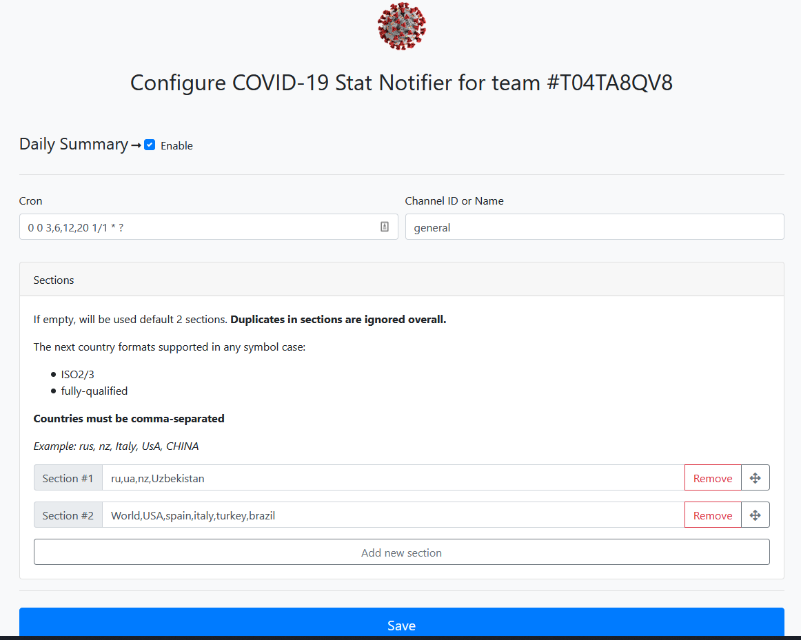

Coronavirus (COVID-19) statistics for Slack

COVID-19 datasource: https://corona.lmao.ninja 

## Features

- Send statistics by `/corona [contries]` where `[countries]` is comma separated list of contries
  
  Supported country formats in any case:
    - ISO codes (2 or 3 symbols)
    - Fully-qualified names
    
  *Countries list can be omitted, then app will send statistics with top infected countries*
  
   

- Send statistics chart by `/corona-chart [countries]` where `[countries]` is comma separated list of contries
  
  Supported country formats in any case:
    - ISO codes (2 or 3 symbols)
    - Fully-qualified names
    
  *Countries list can be omitted, then app will send statistics with top infected countries*
  
   

- Send statistics on cron expression basis
    
    Daily statistics for your team can be enabled when go to https://corona.mdsina.ru/admin/manage
    You will be logged through Slack OAuth2.
    
    *Important note:* Slack App must be installed to your team and you must be in the team to allow to configure statistics. \
    Changed configuration will be applied at least 20 second after saving.
    
    

